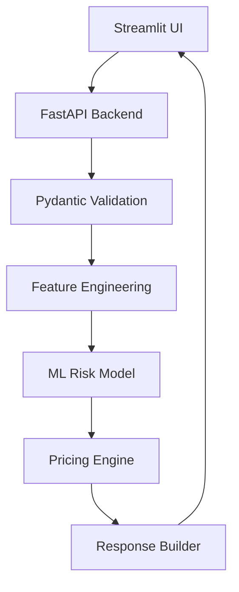

# 🇩🇰 Nordic Insurance AI

An end-to-end **AI-powered insurance pricing system** that predicts customer risk and calculates dynamic insurance premiums using Machine Learning + Business Rules.

---

## 📌 Highlights

- End-to-end ML system (UI → API → Model → Pricing)
- Real-world insurance use case (Denmark 🇩🇰)
- Explainable AI with transparent pricing
- Production-style modular architecture

---

## 🚀 Live Workflow

High-level flow of the system:

```text
Streamlit UI  
↓  
FastAPI `/predict` Endpoint  
↓  
Pydantic Validation  
↓  
Feature Engineering / Preprocessing
↓  
ML Risk Prediction  
↓  
Premium Calculation (Business Rules)  
↓  
Response to UI
```

---

## 🏗️ System Architecture

Detailed component-level architecture:


---

## 🗂️ Dataset & Model

The system is built using an insurance dataset containing demographic, health, and lifestyle features.

### 📊 Dataset Features
- Age  
- BMI-related features (height, weight)  
- Income level  
- Smoking status  
- City/location  
- Occupation  

### ⚙️ Data Processing
- Data is cleaned and preprocessed  
- Categorical features are encoded  
- Numerical features are normalized  
- Feature engineering is performed to capture additional patterns and improve model performance  


### 🤖 Model Details

- **Model Type:** Gradient Boosting Classifier  
- **Task:** Multi-class classification (Low / Medium / High risk)  
- **Output:** Risk category with confidence score  

---

## 🔄 System Overview

1. User enters details in Streamlit UI  
2. Request is sent to FastAPI backend  
3. Pydantic validates input data  
4. Features are engineered/preprocessed  
5. ML model predicts risk category  
6. Pricing engine calculates insurance premium  
7. Response is formatted and returned  
8. Streamlit displays results  

---

## ⚙️ Features

- Risk classification (Low / Medium / High)
- Dynamic premium calculation using business rules
- City-based risk scoring (Denmark-focused 🇩🇰)
- Lifestyle-based adjustments (smoking, income)
- Input validation using Pydantic
- Detailed explanation of pricing factors
- Personalized savings recommendations 

---

## 🧠 Explainability

The system provides transparent insurance decisions by breaking down how the final risk and premium are calculated.

### 🔍 Key Factors

- **ML Model Output** – Base risk predicted from user data  
- **City Adjustment** – Location-based risk variation  
- **Smoking Factor** – Increased risk for smokers  
- **Income Impact** – Normalization for fair pricing  

### ✅ Outcome
- Transparent  
- Interpretable  
- User-friendly

---

## 📦 Tech Stack

### 🖥️ Backend
- Python  
- FastAPI  
- Pydantic  

### 🤖 Machine Learning
- Scikit-learn  
- Pandas  
- Pickle  

### 🌐 Frontend
- Streamlit  

---

## 📊 Input & Output Overview

### 🧾 Input Features
- Age (18–65)  
- Weight (55–100 kg)  
- Height (160–195 cm)  
- Annual Income (DKK 280k–800k)  
- Smoking Status  
- City (Denmark)  
- Occupation  

### 🎯 Model Output
- Risk Category (Low / Medium / High)  
- Confidence Score  
- Final Insurance Premium (DKK)  
- Explanation of pricing factors  
- Personalized savings tips

  ---

## 🧮 Pricing Logic

The final insurance premium is calculated using a rule-based pricing engine that adjusts risk based on multiple factors.

### 💰 Formula

`Final Premium = Base Premium × City Risk × Smoking Factor × Income Factor × Tax Factor`

### ⚙️ Key Adjustments

- **City Risk** – Location-based risk multiplier (Denmark regions 🇩🇰)  
- **Smoking Factor** – Higher premium for smokers  
- **Income Factor** – Adjusts affordability and risk level  
- **Tax Factor** – Regional insurance tax adjustment  

---

## 📁 Project Structure

```text
NordicInsureAI/
│
├── backend/
│   ├── app.py                # FastAPI entry point
│   ├── predict.py           # ML inference logic
│   ├── config/              # Business rules & settings
│   │   ├── city_tiers.py
│   │   ├── nordic_adjustments.py
│   │   ├── pricing_service.py
│   │   └── settings.py
│   │
│   ├── model/               # Trained ML model (.pkl)
│   │   └── insurance_premium_predictor_model.pkl
│   │
│   ├── schema/              # Pydantic validation models
│   │   ├── user_input.py
│   │   └── prediction_response.py
│   │
│   └── utils/               # Helper functions
│       └── preprocess.py
│
├── frontend/
│   ├── assets/              # Images, logos
│   │   └── logo.png
│   └── streamlit_app.py    # UI application
│
├── data/                    # Dataset files
│   └── insurance_premium_dataset_sample.csv
│
├── notebooks/               # Experiments & training
│   ├── Dataset.py
│   └── ml_model_new.ipynb
│
├── artifacts/               # Generated outputs (reports/logs)
│
├── requirements.txt
└── README.md
```

---

## 📡 FastAPI Layer

The backend exposes a REST API that handles:

- Input validation
- ML prediction
- Pricing calculation
- Response formatting

### 📥 Example Request (FastAPI)

```json
{
  "age": 30,
  "weight": 75,
  "height": 180,
  "income_dkk": 500000,
  "smoker": false,
  "city": "Copenhagen",
  "occupation": "private_job"
}
```

### 📤 Example Response

```json
{
  "predicted_category": "Medium",
  "confidence": 0.92,
  "final_premium_dkk": 8200,
  "currency": "DKK",
  "explanation": [
     "Your insurance starts from a base price of 600 DKK based on your risk category (Medium)",
     "Living in Esbjerg affects your risk score (multiplier: 1.0)",
     "Smoking increases health risk and therefore your premium",
     "Your income level (DKK 460000.0) adjusts affordability (multiplier: 1.0)",
     " A standard Danish insurance tax is applied to the final premium"
  ],
  "savings_tips": [
    "Avoid smoking to reduce premium",
    "Living in low-risk city reduces cost"
  ]
}
```
---

## 🖥️ Streamlit Application

Interactive frontend for the insurance risk and pricing system.

### ⚙️ Features
- User input form (age, income, city, lifestyle)
- Sends request to FastAPI `/predict`
- Displays:
  - Risk category
  - Confidence score
  - Final premium (DKK)
  - Explanation of factors
  - Savings tips

### 📊 Visualization
- Waterfall chart showing:
  - Base ML risk
  - City adjustment
  - Smoking factor
  - Income adjustment

### 📄 PDF Report
  - Downloadable text-only report
  - Includes risk, premium, explanation, and tips  
  - Sample: `artifacts/insurance_report.pdf`

  ---
  
## 🚀 Run Locally

### 🧬 Clone Repository

```bash
git clone https://github.com/parul01101991/NordicInsureAI.git
```

### ⚙️ Install Dependencies

```bash
pip install -r requirements.txt
```

### 🖥️ Start Backend (FastAPI)

```bash
uvicorn backend.app:app --reload
```

### 🌐 Start Frontend (Streamlit)

```bash
streamlit run frontend/streamlit_app.py
```
---

## 🎯 Design Principles

- Separation of concerns  
- Modular architecture  
- Explainable AI (XAI)  
- Scalable backend design  
- Business-rule driven pricing
  
---

## 📈 Future Improvements
- Docker deployment
- Cloud hosting 
- Database integration
- CI/CD pipeline
- Model retraining automation

---

## 👩‍💻 Author

**Parul Sharma** 

AI/ML Engineer | Applied ML & DL 

## ⭐ Acknowledgement

If you found this project useful, consider starring the repository.
